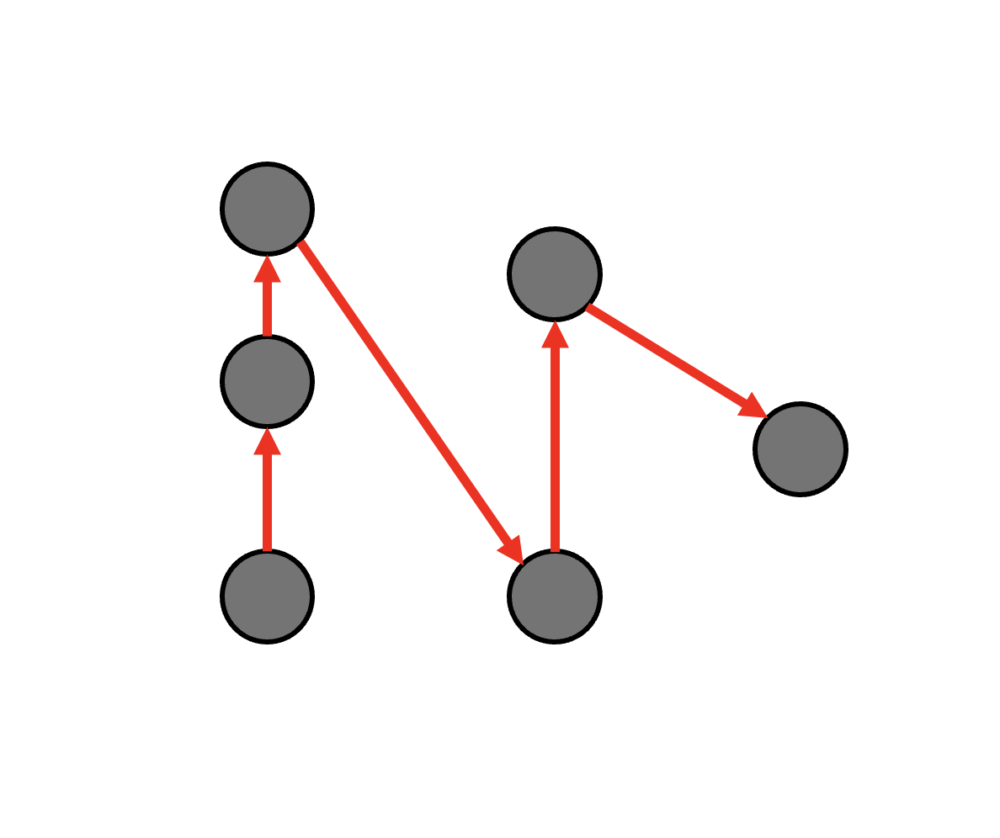

 

## 문제 링크

[https://www.acmicpc.net/problem/29757](https://www.acmicpc.net/problem/29757)

## 사용한 알고리즘

 정렬, 애드혹 

## 풀이

 선분끼리 교차만 하지 않으면 되므로, 입력받은 점들은 x좌표값을 기준으로 정렬하고,  같은 x좌표값일 경우엔 y좌표값을 기준으로 정렬한다.   그런뒤 앞뒤의 좌표값을 서로 연결 시켜주면

 와 같이 지그재그 모양으로 선분끼리 교차하지 않고 연결된다.

## 코드

  

